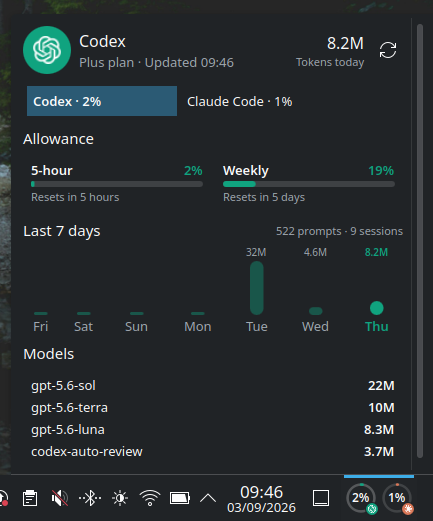
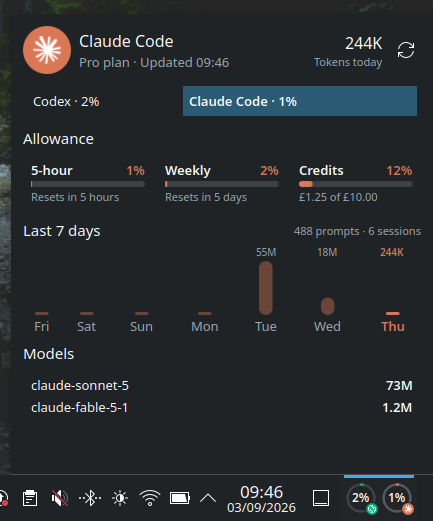

# AI Usage

A Plasma 6 widget for monitoring AI coding-agent usage. It shows subscription
allowances, reset times, local token activity, and model totals for Codex and
Claude Code.

## Screenshots





## Features

- Codex subscription usage windows and reset times via `codex app-server`
- Claude Code subscription windows and usage-credit spend
- Seven-day local token activity with prompt and session counts
- Token totals grouped by model
- Separate provider gauges and configurable refresh interval

## Requirements

- KDE Plasma 6
- Python 3
- Codex CLI and/or Claude Code, installed and authenticated

The providers are optional: enable only the tools you use. The collector uses
only Python's standard library and stores no credentials.

Local statistics are calculated from Codex session records under `CODEX_HOME`
(normally `~/.codex`) and Claude Code transcripts under `CLAUDE_CONFIG_DIR`
(normally `~/.claude`). They describe this machine, scoped to the same
seven-day window as the activity chart, while limits and account activity
come from each provider's service.

## Try the collector

```sh
./bin/ai-usage | python3 -m json.tool
```

The collectors use only the Python standard library. Codex authentication stays
inside `codex app-server`. The Claude collector reads the existing Claude Code
OAuth token solely to request subscription limits from Anthropic; it never
prints or stores that token. Local Claude statistics work without that request.

## Install for the current user

```sh
./scripts/install.sh
```

This bundles `collector/` and the collector launcher into the plasmoid package
itself before installing it with `kpackagetool6`, so the widget is
self-contained - nothing is installed outside its own applet directory, and
`./scripts/uninstall.sh` removes it in one step.

Then add **AI Usage** from Plasma's widget picker. If it does not appear
immediately, restart the Plasma shell or log out and back in. On a
systemd-managed Plasma session, you can run:

```sh
systemctl --user restart plasma-plasmashell.service
```

The collector locates Codex from the desktop session `PATH` and common per-user
install locations. If Codex is installed somewhere unusual, set `CODEX_BIN` to
its absolute path before starting Plasma.

Right-click the widget and open **Configure AI Usage…** to enable or disable
Codex and Claude Code independently, or to change the refresh interval.

For development, run:

```sh
plasmawindowed com.github.dean.aiusage
```

Uninstall with `./scripts/uninstall.sh`.

## Layout

```text
bin/ai-usage             bundled all-provider collector launcher
collector/               collection and normalization logic
plasmoid/package/        Plasma 6 package (install.sh bundles bin/ and collector/ into contents/)
schemas/                 provider record contract
tests/                    collector tests
```

Provider records are intentionally display-oriented JSON. A future provider
only needs to emit the same contract and place its record in the state
directory; it does not need to know anything about QML.
